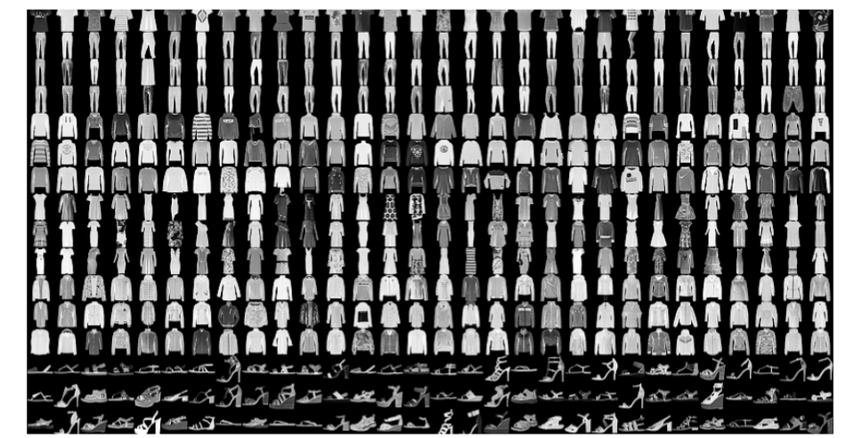

# Artificial Intelligence Project: Nueral Network
## Assignment Goals
* Get Pytorch set up for your environment.
* Familiarize yourself with the tools.
* Implementing and training a basic neural network using Pytorch.
* Happy deep learning:)
## Summary
* Home-brewing every machine learning solution is not only time-consuming but potentially error-prone. One of the reasons we’re using Python in this course is because it has some very powerful machine learning tools. Besides common scientific computing packages such as SciPy and NumPy, it’s very helpful in practice to use frameworks such as Scikit-Learn, TensorFlow, Pytorch, and MXNet to support your projects. The utilities of these frameworks have been developed by a team of professionals and undergo rigorous testing and verification. In this homework,  we’ll be exploring the [<span style="color: blue">Pytorch</span>](https://pytorch.org) framework. Please complete  the functions in the template provided: <span style="color: red">intro_pytorch.py</span>.
## Part 1: Setting up the Python Virtual Environment
* In this assignment, you will familiarize yourself with the Python Virtual Environment. Working in a virtual environment is an important part of working with modern ML platforms, so we want you to get a flavor of that through this assignment. Why do we prefer virtual environments? Virtual environments allow us to install packages within the virtual environment without affecting the host system setup. So you can maintain project-specific packages in respective virtual environments.
* We suggest that you use the CS lab computers for this homework. You can also work on your personal systemfor the initial development, but finally, you will have to test your model on the CSL lab computers. Find more instructions: [<span style="color:blue">How to access CSL Machines Remotely</span>](https://csl.cs.wisc.edu)
* The following are the installation steps for Linux (CSL machines are recommended). You will be working on Python 3 (instead of Python 2 which is no longer supported). Read more about Pytorch and Python version [<span style = "color:blue">here</span>](https://pytorch.org/get-started/locally/). To check your Python version use:
```bash
python -v or python3 -v
```
* If you have an alias set for python=python3 then both should show the same version(3.x.x)
* **Step 1:** For simplicity, we use the [<span style = "color:blue">venv</span>](https://docs.python.org/3/library/venv.html) module (feel free to use other virtual envs such as [<span style = "color:blue">Conda</span>](https://www.anaconda.com)).To set up a Python Virtual Environment named Pytorch:
```bash
python3 -m venv /path/to/new/virtual/environment
```
* For example, if you want to put the virtual environment in your working directory:
```bash
python3 -m venv Pytorch
```
* (Optional: If you want to learn more about Python virtual environments, a very good tutorial can be found [<span style = "color:blue">here</span>](https://realpython.com/python-virtual-environments-a-primer/)
* **Step 2**: Activate the environment:
* Let’s suppose the name of our virtual environment is Pytorch (you can use any other name if you want). You can activate the environment by the following command:
```bash
source Pytorch/bin/activate
```
* **Step3:** From your virtual environment shell, run the following commands to upgrade pip and install the CPU version of Pytorch:
```bash
pip install --upgrade pip
pip install torch==1.12.1 torchvision==0.13.1  torchaudio==0.12.1 -f https://download.pytorch.org/whl/cpu/torch_stable.html
```
* You can check the version of the packages installed using the following command:
```bash
pip freeze
```
* Note: to deactivate the virtual environment, just type
```bash
deactivate
```
## Part 2: Build Your First Neural Network
* In this section, we will guide you step by step to build a simple deep learning model for predicting labels of hand-written images. You will learn how to build, train, evaluate models, and make predictions on test data using this model. We expect you to implement the following  functions in Python. 
    * getdataloader(training=True)
        – Input: an optional boolean argument (default value is True for training dataset)
        – Return: Dataloader for the training set (if training = True) or the test set (if training = False)
    * build_model()
        – Input: none–Return: an untrained neural network model
    * train_model(model, trainloader, criterion, T)
        – Input: the model produced by the previous function, the train DataLoader produced by the first function, the criterion, and the number of epochs T for training
        – Return: none
    * evaluate_model(model, testloader, criterion, showloss=True)
        – Input: the trained model produced by the previous function, the test DataLoader, and the criterion.
        – It prints the evaluation statistics as described below (displaying the loss metric value if and only if theoptional parameter has not been set to False)
        – Return: none
    * predict_label(model, testimages, index)
        – Input: the trained model and test images
        – It prints the top 3 most likely labels for the image at the given index, along with their probabilities
        – Return: none
* You are free to implement any other utiltiy function. But we will only be testing the functionality using the above 5 APIs, so make sure that each of them follows the exact function signature and returns. You can also use helper methods to visualize the images from the FashionMNIST dataset for a better understanding of the dataset and the labels. But it is entirely optional and does not carry any points.
## Import necessary packages
* Here are some of the useful modules that may help us save a ton of efforts in the project:
```python
import torch
import torch.nn as nn
import torch.nn.functional as F
import torch.optim as optim
from torchvision import datasets, transforms
```
* The following 5 sections explain the details for each of the above functions you are required to implement respectively.
## Get the DataLoader
* We will use the [<span style ="color:blue">Fashion-MNIST</span>](https://github.com/zalandoresearch/fashion-mnist) dataset, each example is a 28x28 grayscale image, associated with a label from 10 classes.



* **Hint 1:** note that Pytorch already contains various datasets for you to use, so there is no need to manually download from the Internet. Specifically,
```python
torchvision.datasets.FashionMNIST()
```
* can be used to retrieve and return a Dataset object torchvision.datasets. FashionMNIST which is a wrapper that contains image inputs (as 2D  arrays) and labels (’T-shirt top’, ’Trouser’,  ’Pullover’, ’Dress’, ’Coat’, ’Sandal’,,’Shirt’,,’Sneaker’,’Bag’,’Ankle Boot’):
```python
train_set=datasets.FashionMNIST(‘./data,train=True,
                                download=True,transform=custom_transform)
test_set=datasets.FashionMNIST(’./data’, train=False,
                                transform=custom_transform)
```
* The train set contains images and labels we’ll be using to train our neural network; the test set contains images and labels for model evaluation. Here we set the location where the dataset is downloaded as the data folder in the current directory. Note that input preprocessing can be done by specifying transform as our custom_transform (you don’t need to change this part)
```python
custom_transform = transforms.Compose([
    transforms.ToTensor(),
    transforms.Normalize((0.1307,), (0.3081,))
    ])
```
* transforms.ToTensor() converts a PIL Image or numpy.ndarray to tensor.
* transforms.Normalize() normalizes the tensor with a mean and standard deviation which goes as the two parameters respectively. Feel free to check the [<span style="color:blue">official doc</span>](https://pytorch.org/docs/stable/torchvision/transforms.html?highlight=normalize#torchvision.transforms.Normalize) for more details
* **Hint 2:** After obtaining the dataset object, you may wonder how to retrieve images and labels during training and testing. Luckily, Pytorch provides such a class called torch.utils.data.DataLoader that implements the iterator protocol. It also provides useful features such as:
    * Batching the data
    * Shuffling the data
    * Load the data in parallel using multiprocessing.
    * ...
* Below is the full signature (for more details, check [<span style="color:blue">here</span>](https://pytorch.org/docs/stable/data.html)):
```python
DataLoader(dataset, batch_size=1, shuffle=False,sampler=None,
            batch_sampler=None, num_workers=0, collate_fn=None,
            pin_memory=False, drop_last=False, timeout=0,
            worker_init_fn=None,*, prefetch_factor=2,
            persistent_workers=False)
```
* As an introductory project, we won’t use complicated features. We ask you to set the batch_size = 64 for both train loader and test loader. Besides, set shuffle=False for the test loader. Given a Dataset object data_set, we can obtain its DataLoader as follows:
```python
loader = torch.utils.data.DataLoader(data_set, batch_size = 64)
```
* Putting it all together, you should be ready to  implement the get_data_loader() function. Note that when  the optional argument is unspecified, the function should return the Dataloader for the training set. If the optional argument is set to False, the Dataloader for the test set is returned. The expected output is as follows:
```python
train_loader = get_data_loader()
print(type(train_loader))
<class ’torch.utils.data.dataloader.DataLoader’>
print(train_loader.dataset)
Dataset MNIST
    Number of datapoints: 60000
    Root location: ./data
    Split: Train
    StandardTransform
Transform: Compose(
            ToTensor()
            Normalize(mean=(0.1307,), std=(0.3081,))
            )  
test_loader = get_data_loader(False)
```
## Build Your Model
* After setting up the data loaders, let’s build the model we’re going to use with the datasets. Neural networks in Pytorch are composed of layers. You’ve heard about these in the lecture, but take a minute to look through this [<span style="color:blue">simple example</span>]() (it’s nice and short) to get an idea of what the implementation logistics will look like. We use thefollowing layers in this order:
1. A Flatten layer to convert the 2D pixel array to a 1D array.
2. A Dense layer with 128 nodes and a ReLU [<span style="color:blue">activation</span>]().
3. A Dense layer with 64 nodes and a ReLU activation.
4. A Dense layer with 10 nodes.
* In this assignment, you are expected to use a [<span style="color:blue">Sequential</span>]() container to hold these layers. As a fun practice, we askyou to fill out the positions marked with “?” with the appropriate parameters.
```python
model = nn.Sequential(
    nn.Flatten(),
    nn.Linear(?, ?),
    nn.ReLU()
    nn.Linear(?, ?),
    ...
    )
```
* After building the model, the expected output should be like this:
```python
model build_model()
print(model)
Sequential(
    (0): Flatten()
    (1): Linear(in_features=?, out_features=?, bias=True)(2): ReLU()
    (3): Linear(in_features=?, out_features=?bias=True)
    ...
)
```
* Note that the Flatten layer just serves to reformat the data.
## Train Your Model
* After building the model, now we are ready to implement  the training procedure. One of the parameters of train_model(..., criterion, ...) is the criterion, which can be specified as:
```python
ceriterion = nn.CrossEntropyLoss()
```
* Here we use the cross-entropy loss nn.CrossEntropyLoss(), which combines nn.LogSoftmax() and nn.NLLLoss().Inside the function trainmodel(),  you may need to pick your favorite optimization algorithm by setting up anoptimizer first: here we use stochastic gradient descent (SGD) with a learning rate of 0.001 and momentum of 0.9:
```python
opt = optim.SGD(model.parameters(), lr=0.001, momentum=0.9)
```
* A note on the major difference between gradient descent (GD) and SGD: in GD, all samples in the training set are used to update parameters in a particular iteration; while in SGD, only a random subset of training samples are used to update parameters in a particular iteration. SGD often converges much faster than GD for large datasets.
* The standard training procedure contains 2 for loops:  the outer for loop iterates over epochs, while the inner for loop iterates over batches of (images, labels) pairs from the train DataLoader. Feel free to check the Train the network part in this [<span style="color:blue">official tutorial</span>]() for more details. Please pay attention to the order of zero_grad(),backward() and step().  A kind reminder:  please set your model to train mode before iterating over the dataset. This can be done with the following call:
```python
model.train()
```
* We ask you to print the training status after every epoch of training in the following format (it should have 3components per line):
* Train Epoch: ? Accuracy: ?/?(??.??%) Loss: ?.???
* Then the training process (for 5 epochs) will be similar to the following (numbers can be different):

Train Epoch: 0   Accuracy: 42954/60000(71.59%) Loss: 0.833
Train Epoch: 1   Accuracy: 49602/60000(82.67%) Loss: 0.489
Train Epoch: 2   Accuracy: 50730/60000(84.55%) Loss: 0.436
Train Epoch: 3   Accuracy: 51383/60000(85.64%) Loss: 0.405
Train Epoch: 4   Accuracy: 51820/60000(86.37%) Loss: 0.383
* Here are a few specific requirements for the format:
    * We count the first epoch as Epoch 0
    * All the information should be summarized in one line for each epoch. (e.g. in total you should print 5 lines if you train for 5 epochs)
    * Accuracy in percentage should be put inside parentheses
    * Accuracy should be printed before Loss  
    * Loss denotes the average loss per epoch (accumulated loss in an epoch/length of the dataset)
    * You should be able to reach at least 80% accuracy after 5 epochs of training.
## Evaluate Your Model
* After the model is trained, we need to evaluate how good it is on the test set. The process is very similar to that of training, except that you need to turn the model into evaluation mode:
```python
model.eval()
```
* Besides, there is no need to track gradients during testing, which can be disabled with the context manager:
```python
with torch.no_grad():
    for data, labels in test_loader:
        ...
```
* You are expected to print both the test Loss and the test Accuracy if `show_loss` is set to True (print Accuracy only otherwise) in the following format:
```python
evaluate_model(model, test_loader, criterion, show_loss = False)
```
Accuracy: 85.39%
```python
evaluate_model(model, test_loader, criterion, show_loss = True)
```
Average loss: 0.4116
Accuracy: 85.39%
* Format the Accuracy with two decimal places and the accuracy should be shown as a percentage. Format the Loss with four decimal places. The loss should be printed in a separate line before Accuracy (as shown above).
## Predict the Labels
* Instead of testing on a whole dataset, sometimes it’s more convenient to examine the model’s output on a single image.
* As it’s easier for humans to read and interpret probabilities, we need to use a [<span style="color:blue">Softmax</span>]() function to convert the output of your final Dense layer into probabilities (note that by default your model outputs [<span style="color:blue">logits</span>]()). Generally, Softmax is often used as the activation for the last layer of a classification network because the result can beinterpreted as a categorical distribution. Specifically, once we obtain the logits, we can use:
```python
prob = F.softmax(logits, dim=?)
```
* You can assume the input testimages in `predict_label(model, testimages, index)`is a torch tensor with the shape Nx1x28x28. Your implementation should display the top three most likely class labels (<span style="color:red">in descending order of predicted probability; three lines in total</span>) for the image at the given index along with their respective  probabilities in percentage (again,  your output will vary in its exact numbers but should follow the format below):
```python
predict_label(model, pred_set, 1)
```
Pullover: 98.02%
Shirt: 1.58%
Coat: 0.38%
* The index are assumed to be valid. We assume the class names are:
```python
class_names = [’T-shirt/top’,’Trouser’,’Pullover’,’Dress’,’Coat’,’Sandal’,’Shirt’,’Sneaker’,’Bag’,’Ankle Boot’]
```